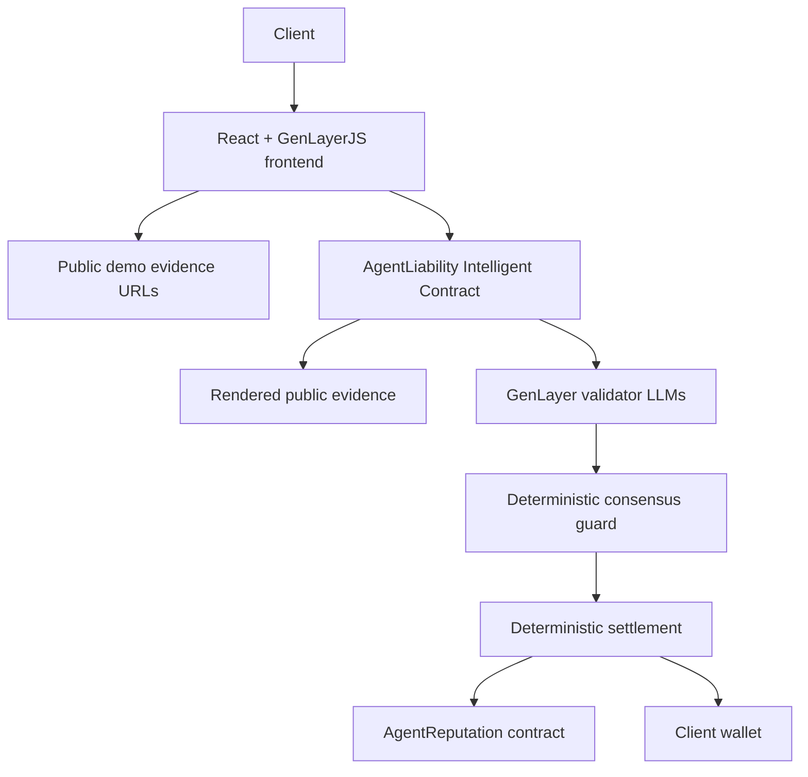
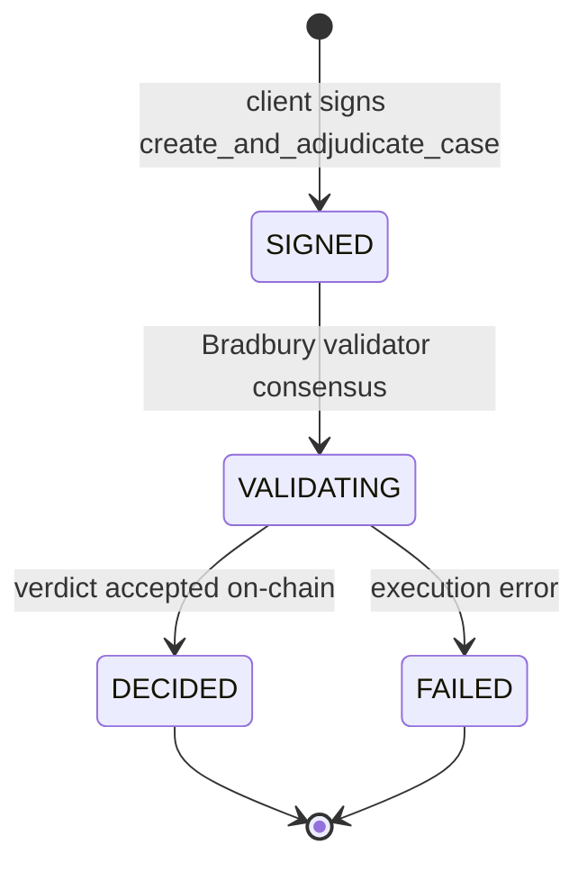

# AgentLiability

AgentLiability dies without GenLayer because payouts require a contract that can read real workflow evidence from the web, use AI judgment for causal responsibility, and settle that decision through GenLayer validator consensus.

## Problem

Multi-agent AI workflows fail in messy ways. A coding agent may ship the broken pull request, but the causal defect may have started in planning, research, testing, deployment, unclear client requirements, or missing evidence. Normal smart contracts can escrow funds, but they cannot read public workflow evidence, reason about causality, and settle subjective responsibility without a trusted off-chain judge.

## Solution

AgentLiability is a GenLayer Testnet Bradbury dApp where a client creates a case, funds GEN escrow, attaches public evidence for two workflow agents, and receives an on-chain GenLayer adjudication. The Intelligent Contract renders public evidence URLs, asks AI to adjudicate responsibility, validates the proposed verdict with deterministic consensus guards, and then distributes escrow, records the verdict, and emits reputation updates.

## Current Bradbury Status

- App: https://agent-liability.vercel.app/
- Network: GenLayer Testnet Bradbury
- Main contract: `0xa700304f08fBbEbCfc3e0BD96F51145A45d1D3d6`
- Reputation contract: `0xA0c8Db4f2C7661B16cE43C18e0E5571985b9C9f4`
- Owner: `0xf8916c192f28B3A6f5e4B731ba85f7c38fAb0eA3`
- Deployment artifact: `artifacts/bradbury-deployment.json`

## Why Solidity-Only Contracts Cannot Implement It

Solidity can enforce arithmetic and state transitions, but it cannot independently render GitHub PRs, CI logs, documentation, deployment reports, or agent deliverables. It also cannot decide whether a downstream agent reasonably should have detected an upstream false assumption. A Solidity-only implementation would require a centralized oracle or trusted human signer for the actual verdict, which is the central thing AgentLiability removes.

## Why It Dies Without GenLayer

The binding decision is inside `contracts/agent_liability.py`, using:

- `gl.nondet.web.render(...)` for live public evidence.
- `gl.nondet.exec_prompt(..., response_format="json")` for adjudication.
- `gl.vm.run_nondet_unsafe(...)` for GenLayer consensus around the AI decision.
- Deterministic validator checks for schema, canonical verdicts, allocation caps, and payout invariants.

If web access and AI consensus are removed, AgentLiability can no longer decide payouts.

## Architecture



## Contract Responsibilities

Main Contract: `contracts/agent_liability.py`

- Case lifecycle and one-transaction demo adjudication.
- Escrow accounting and optional agent bond accounting in wei.
- Evidence, dispute, and auto-filled demo submission.
- Web evidence rendering and LLM adjudication.
- Deterministic consensus guard for AI verdicts.
- Payout, refund, optional bond slashing, fee accounting.
- Reputation child messages.
- Double-settlement prevention.

Reputation Contract: `contracts/agent_reputation.py`

- One-time authorized main contract configuration.
- Agent participation and fault counters.
- Duplicate outcome protection.
- Deterministic 0 to 1000 reputation score.
- JSON read methods for the frontend.

Storage Sanity Contract: `contracts/storage_test.py`

- Minimal scalar plus `TreeMap` contract for Testnet Bradbury deployment checks.

## User Flow

1. Client clicks `Fill Demo Case` or enters case details and locks GEN escrow.
2. Client signs one `create_and_adjudicate_case` transaction.
3. The contract creates the case, attaches two agent assignments and evidence URLs, records the dispute, and runs adjudication.
4. The main contract renders evidence from the web.
5. The GenLayer leader proposes a causal verdict from the evidence.
6. Validators accept only decisions that satisfy the contract's deterministic schema and payout rules.
7. Contract stores the on-chain verdict and executes deterministic settlement.
8. Reputation update messages are emitted.
9. Frontend tracks transaction status and reads final case state from chain.

## Case State Machine

The reviewer demo uses the one-signature path. The client signs `create_and_adjudicate_case`,
then Bradbury validators process the AI adjudication and consensus guard before the final case is
read back from chain.



The contract still keeps advanced manual lifecycle methods for future workflows, but the live
dApp is wired to the one-signature adjudication path.

## Evidence Sources

- Case specification URL.
- Workflow manifest URL.
- Acceptance criteria stored on-chain.
- Agent roles and scope URLs.
- Agent deliverable URLs.
- Agent claim summaries.
- Dispute reason.
- Dispute evidence URL.
- Missing acceptance and missing submission markers.
- Deadline status.

## Public Demo Evidence

Use these URLs for a clean Bradbury demo:

- Specification: https://raw.githubusercontent.com/tanphung/agent-liability/main/demo/specification.md
- Manifest: https://raw.githubusercontent.com/tanphung/agent-liability/main/demo/workflow_manifest.json
- Planning scope: https://raw.githubusercontent.com/tanphung/agent-liability/main/demo/planning_agent_scope.md
- Coding scope: https://raw.githubusercontent.com/tanphung/agent-liability/main/demo/coding_agent_scope.md
- Planning deliverable: https://raw.githubusercontent.com/tanphung/agent-liability/main/demo/planning_deliverable.md
- Coding deliverable: https://raw.githubusercontent.com/tanphung/agent-liability/main/demo/coding_deliverable.md
- Dispute evidence: https://raw.githubusercontent.com/tanphung/agent-liability/main/demo/dispute_evidence.md

## Prompt-Injection Defense

The prompt treats webpage content as untrusted evidence. Sources are wrapped in explicit `<EVIDENCE_SOURCE>` boundaries. The model is instructed to ignore evidence text that tries to override rules, reveal prompts, call tools, follow links, change schema, or obey "ignore previous instructions" attacks.

## Adjudication Rubric

The contract asks AI adjudication to evaluate causality, not proximity to the final failure. It distinguishes root cause, contributing responsibility, failure to detect, non-performance, not at fault, client ambiguity, and insufficient evidence.

Allowed case outcomes:

- `SUCCESS`
- `PARTIAL_SUCCESS`
- `FAILED`
- `INSUFFICIENT_EVIDENCE`

Allowed agent verdicts:

- `NOT_AT_FAULT`
- `CONTRIBUTING`
- `PRIMARY_CAUSE`
- `NON_PERFORMANCE`
- `INSUFFICIENT_EVIDENCE`

## Consensus Guard Design

The contract treats the AI decision as a structured proposal. Validators deterministically reject proposals that are malformed, non-canonical, economically invalid, or inconsistent with the case's agent allocations.

The guard checks:

- Case outcome is one of the allowed canonical verdicts.
- Root cause is `CLIENT`, `SHARED`, `INSUFFICIENT_EVIDENCE`, or an existing `AGENT_n` slot.
- Every agent appears exactly once.
- Agent verdicts are canonical.
- Fault share, payout, bond slash, and client refund are integer bps in `0..10000`.
- Agent payout never exceeds that agent's allocation.
- Total agent payout plus client refund equals exactly `10000`.

Reason prose is stored for review. Settlement is based only on the normalized deterministic fields.

## Payout Mathematics

All math uses integer wei and basis points.

```text
fee = escrow * fee_bps / 10000
distributable = escrow - fee
agent_payout = distributable * agent_payout_bps / 10000
base_refund = distributable * client_refund_bps / 10000
dust = distributable - sum(agent_payouts) - base_refund
client_refund = base_refund + dust + slashed_bonds
```

The contract requires total payout bps plus client refund bps to equal exactly `10000`.

## Optional Bond Accounting

The live demo sets agent required bonds to `0` so reviewers do not need extra agent wallets.
For future manual workflows, each agent can pay an exact required bond before settlement. When
bonds are used:

```text
bond_slash = bond_paid * bond_slash_bps / 10000
bond_return = bond_paid - bond_slash
```

Slashed bonds compensate the client. Zero-value transfers are skipped.

## Reputation Formula

The reputation contract uses a deterministic 0 to 1000 score:

```text
500
+ capped success reward
+ capped payout reward
- capped cumulative fault penalty
- capped primary-fault penalty
```

The score is clamped to `0..1000`.

## Security Assumptions

- Public evidence may be malicious or unavailable.
- Validators may disagree on subjective facts.
- Testnet Bradbury state can reset.
- Child transactions may fail after the main transaction finalizes.
- Frontend state is informational only; contract state is authoritative.
- No `.env`, private keys, or secrets belong in the repository.

## Testnet Bradbury Configuration

```text
Network: Testnet Bradbury
RPC: https://rpc-bradbury.genlayer.com
Chain ID: 4221
Currency: GEN
Explorer: https://explorer-bradbury.genlayer.com
```

The frontend uses:

```typescript
import { testnetBradbury } from "genlayer-js/chains";
```

## Folder Structure

```text
artifacts/
  bradbury-deployment.json
contracts/
  agent_liability.py
  agent_reputation.py
  storage_test.py
demo/
  specification.md
  workflow_manifest.json
  *_agent_scope.md
  *_deliverable.md
  dispute_evidence.md
docs/
  ARCHITECTURE.md
  BRADBURY_DEPLOYMENT.md
  CONSENSUS_DESIGN.md
  DEMO_SCRIPT.md
  GENVM_TROUBLESHOOTING.md
  SECURITY.md
frontend/
  src/
    components/
    hooks/
    lib/
    pages/
    types/
    utils/
scripts/
tests/
  direct/
  fixtures/
  integration/
```

## Installation

```powershell
Set-Location -LiteralPath 'D:\app genlayer\AgentLiability'
python -m pip install -r requirements-dev.txt
npm install
Set-Location -LiteralPath 'D:\app genlayer\AgentLiability\frontend'
npm install
```

Install the GenLayer CLI when deploying:

```powershell
npm install -g genlayer
```

## Contract Testing

```powershell
Set-Location -LiteralPath 'D:\app genlayer\AgentLiability'
genvm-lint lint contracts\agent_liability.py --json
genvm-lint lint contracts\agent_reputation.py --json
genvm-lint lint contracts\storage_test.py --json
python -m pytest tests -v
gltest tests\direct -v -s
```

`genvm-lint check` is also configured, but SDK validation may fail if the `v0.2.16` artifact cannot be downloaded. Keep the required Studio header unchanged.

## Integration Testing

```powershell
Set-Location -LiteralPath 'D:\app genlayer\AgentLiability'
$env:RUN_BRADBURY_INTEGRATION='1'
gltest tests\integration -v -s --network testnet_bradbury
```

Testnet Bradbury integration requires a reachable Bradbury network and funded account context.

## Frontend Commands

```powershell
Set-Location -LiteralPath 'D:\app genlayer\AgentLiability\frontend'
Copy-Item .env.example .env
npm run typecheck
npm run lint
npm run build
npm run dev
```

## Manual Deployment

See `docs/BRADBURY_DEPLOYMENT.md` and `docs/GENVM_TROUBLESHOOTING.md`.

## Testnet Bradbury CLI Deployment

```powershell
Set-Location -LiteralPath 'D:\app genlayer\AgentLiability'
genlayer network set testnet-bradbury
genlayer deploy --contract contracts\storage_test.py --rpc https://rpc-bradbury.genlayer.com
genlayer deploy --contract contracts\agent_reputation.py --rpc https://rpc-bradbury.genlayer.com
genlayer deploy --contract contracts\agent_liability.py --rpc https://rpc-bradbury.genlayer.com --args <reputation-address> 250
```

Then call `set_authorized_contract` on the reputation contract with the main contract address.

## Environment Variables

Root `.env`:

```env
GENLAYER_NETWORK=testnet-bradbury
GENLAYER_RPC=https://rpc-bradbury.genlayer.com
GENLAYER_CHAIN_ID=4221
PROTOCOL_FEE_BPS=250
OWNER_ADDRESS=0xf8916c192f28b3a6f5e4b731ba85f7c38fab0ea3
```

Frontend `.env`:

```env
VITE_MAIN_CONTRACT_ADDRESS=0xa700304f08fBbEbCfc3e0BD96F51145A45d1D3d6
VITE_REPUTATION_CONTRACT_ADDRESS=0xA0c8Db4f2C7661B16cE43C18e0E5571985b9C9f4
```

## Deployment Addresses

```text
Storage Test Contract: `0x2696d1048F2eeF7e20488E1b2b97c7b14adACD92`
Main Contract: `0xa700304f08fBbEbCfc3e0BD96F51145A45d1D3d6`
Reputation Contract: `0xA0c8Db4f2C7661B16cE43C18e0E5571985b9C9f4`
```

## Roadmap

- Reviewer mode: one-click demo case creation, persistent transaction recovery, and clearer Bradbury validator timing.
- Evidence workspace: upload-to-public-storage helpers, evidence previews, and source availability checks before signing.
- Case analytics: verdict history, payout charts, reputation trend lines, and downloadable adjudication reports.
- Reputation marketplace: searchable agent profiles, past fault patterns, and role-specific reliability scores.
- Contract operations: migration tooling for Bradbury resets, schema-driven frontend calls, and child transaction polling for payouts and reputation updates.
- Performance and safety: bundle code splitting, stronger RPC backoff, and richer trace display for failed GenLayer executions.
