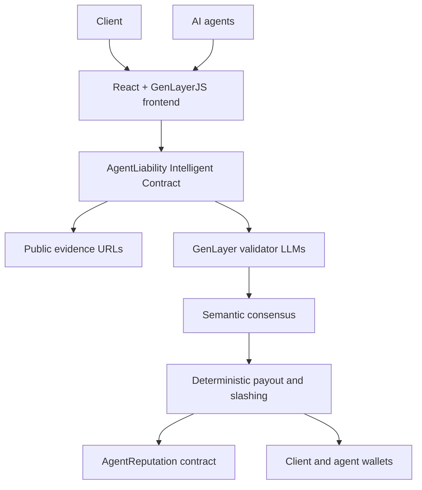
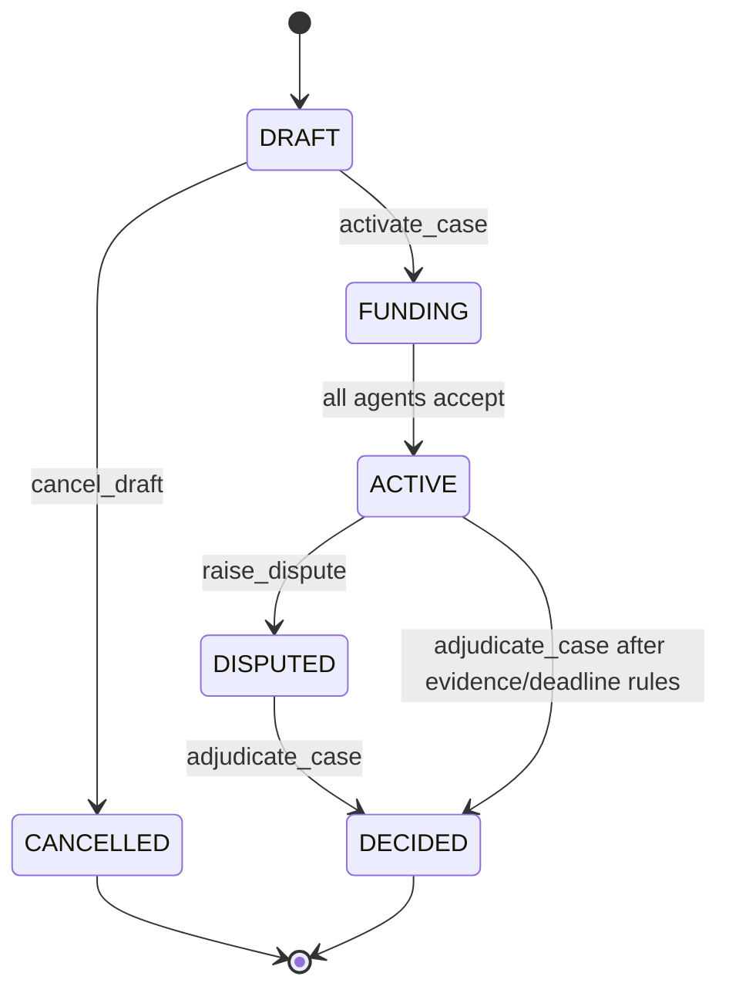

# AgentLiability

AgentLiability dies without GenLayer because payouts require independent validators to read real workflow evidence from the web and agree on subjective causal responsibility across multiple AI agents.

## Problem

Multi-agent AI workflows fail in messy ways. A coding agent may ship the broken pull request, but the causal defect may have started in planning, research, testing, deployment, unclear client requirements, or missing evidence. Normal smart contracts can escrow funds, but they cannot read public workflow evidence, reason about causality, and settle subjective responsibility without a trusted off-chain judge.

## Solution

AgentLiability is a GenLayer Studionet dApp where a client creates a case, funds GEN escrow, assigns 2 to 5 agents, and requires each agent to post a GEN bond. If a dispute arises, the Intelligent Contract renders public evidence URLs, asks GenLayer validators to adjudicate responsibility, checks semantic agreement, and then deterministically distributes escrow, refunds, slashed bonds, and reputation updates.

## Live Deployment

- App: https://agent-liability.vercel.app
- Network: GenLayer Studionet
- Main contract: `0xc57900f71994467a9684C5f8Df5b1A2e2B9A58C6`
- Reputation contract: `0xACdb97A894dDBd1aDCD1fA4E4Da01DaaF809c45d`
- Owner: `0xf8916c192f28B3A6f5e4B731ba85f7c38fAb0eA3`
- Deployment artifact: `artifacts/studionet-deployment.json`

## Why Solidity-Only Contracts Cannot Implement It

Solidity can enforce arithmetic and state transitions, but it cannot independently render GitHub PRs, CI logs, documentation, deployment reports, or agent deliverables. It also cannot decide whether a downstream agent reasonably should have detected an upstream false assumption. A Solidity-only implementation would require a centralized oracle or trusted human signer for the actual verdict, which is the central thing AgentLiability removes.

## Why It Dies Without GenLayer

The binding decision is inside `contracts/agent_liability.py`, using:

- `gl.nondet.web.render(...)` for live public evidence.
- `gl.nondet.exec_prompt(..., response_format="json")` for adjudication.
- `gl.vm.run_nondet_unsafe(...)` for leader and validator execution.
- Semantic validator comparison of material decision fields.

If web access and AI consensus are removed, AgentLiability can no longer decide payouts.

## Architecture



## Contract Responsibilities

Main Contract: `contracts/agent_liability.py`

- Case lifecycle: `DRAFT`, `FUNDING`, `ACTIVE`, `DISPUTED`, `DECIDED`, `CANCELLED`.
- Escrow and agent bond accounting in wei.
- Evidence and dispute submission.
- Web evidence rendering and LLM adjudication.
- Semantic consensus comparison.
- Payout, refund, bond slashing, fee accounting.
- Reputation child messages.
- Double-settlement prevention.

Reputation Contract: `contracts/agent_reputation.py`

- One-time authorized main contract configuration.
- Agent participation and fault counters.
- Duplicate outcome protection.
- Deterministic 0 to 1000 reputation score.
- JSON read methods for the frontend.

Storage Sanity Contract: `contracts/storage_test.py`

- Minimal scalar plus `TreeMap` contract for Studionet deployment checks.

## User Flow

1. Client creates a case and locks GEN escrow.
2. Client adds 2 to 5 agent assignments.
3. Client activates the case.
4. Agents accept and pay exact required bonds.
5. Agents submit public evidence URLs and claim summaries.
6. Client or agent raises a dispute.
7. The main contract renders evidence from the web.
8. Leader and validators independently adjudicate causal responsibility.
9. Contract checks semantic agreement, not just JSON shape.
10. Contract stores verdict and executes deterministic settlement.
11. Reputation update messages are emitted.
12. Frontend tracks main and child transaction states.

## Case State Machine



## Evidence Sources

- Case specification URL.
- Workflow manifest URL.
- Acceptance criteria stored on-chain.
- Agent roles and scope URLs.
- Agent deliverable URLs.
- Agent claim summaries.
- Dispute reason.
- Dispute evidence URL.
- Missing acceptance and missing submission markers.
- Deadline status.

## Prompt-Injection Defense

The prompt treats webpage content as untrusted evidence. Sources are wrapped in explicit `<EVIDENCE_SOURCE>` boundaries. The model is instructed to ignore evidence text that tries to override rules, reveal prompts, call tools, follow links, change schema, or obey "ignore previous instructions" attacks.

## Adjudication Rubric

The contract asks validators to evaluate causality, not proximity to the final failure. It distinguishes root cause, contributing responsibility, failure to detect, non-performance, not at fault, client ambiguity, and insufficient evidence.

Allowed case outcomes:

- `SUCCESS`
- `PARTIAL_SUCCESS`
- `FAILED`
- `INSUFFICIENT_EVIDENCE`

Allowed agent verdicts:

- `NOT_AT_FAULT`
- `CONTRIBUTING`
- `PRIMARY_CAUSE`
- `NON_PERFORMANCE`
- `INSUFFICIENT_EVIDENCE`

## Semantic Consensus Design

The validator independently renders evidence and reruns adjudication. It rejects schema-only consensus. It compares:

- Case outcome.
- Root cause.
- Primary-cause agent.
- Materially faulty agent set.
- Client refund within 600 bps.
- Agent payout within 600 bps.
- Bond slash within 750 bps.
- Fault share within 1000 bps.

Reason prose may differ. Material blame and economics may not.

## Payout Mathematics

All math uses integer wei and basis points.

```text
fee = escrow * fee_bps / 10000
distributable = escrow - fee
agent_payout = distributable * agent_payout_bps / 10000
base_refund = distributable * client_refund_bps / 10000
dust = distributable - sum(agent_payouts) - base_refund
client_refund = base_refund + dust + slashed_bonds
```

The contract requires total payout bps plus client refund bps to equal exactly `10000`.

## Bond Slashing

Each agent pays the exact required bond before the case enters `ACTIVE`. At settlement:

```text
bond_slash = bond_paid * bond_slash_bps / 10000
bond_return = bond_paid - bond_slash
```

Slashed bonds compensate the client. Zero-value transfers are skipped.

## Reputation Formula

The reputation contract uses a deterministic 0 to 1000 score:

```text
500
+ capped success reward
+ capped payout reward
- capped cumulative fault penalty
- capped primary-fault penalty
```

The score is clamped to `0..1000`.

## Security Assumptions

- Public evidence may be malicious or unavailable.
- Validators may disagree on subjective facts.
- Studionet state can reset.
- Child transactions may fail after the main transaction finalizes.
- Frontend state is informational only; contract state is authoritative.
- No `.env`, private keys, or secrets belong in the repository.

## Studionet Configuration

```text
Network: Studionet
RPC: https://studio.genlayer.com/api
Chain ID: 61999
Currency: GEN
Explorer: https://explorer-studio.genlayer.com
```

The frontend uses:

```typescript
import { studionet } from "genlayer-js/chains";
```

## Studionet Limitations

Studionet is a temporary shared development environment. Contract addresses may disappear after reset. Native GEN balances and transfers are simulated by Studio. This is not mainnet or production deployment.

## Folder Structure

```text
contracts/
frontend/
tests/
scripts/
docs/
artifacts/
```

## Installation

```powershell
Set-Location -LiteralPath 'D:\app genlayer\AgentLiability'
python -m pip install -r requirements-dev.txt
npm install
Set-Location -LiteralPath 'D:\app genlayer\AgentLiability\frontend'
npm install
```

Install the GenLayer CLI when deploying:

```powershell
npm install -g genlayer
```

## Contract Testing

```powershell
Set-Location -LiteralPath 'D:\app genlayer\AgentLiability'
genvm-lint lint contracts\agent_liability.py --json
genvm-lint lint contracts\agent_reputation.py --json
genvm-lint lint contracts\storage_test.py --json
python -m pytest tests -v
gltest tests\direct -v -s
```

`genvm-lint check` is also configured, but SDK validation may fail if the `v0.2.16` artifact cannot be downloaded. Keep the required Studio header unchanged.

## Integration Testing

```powershell
Set-Location -LiteralPath 'D:\app genlayer\AgentLiability'
$env:RUN_STUDIONET_INTEGRATION='1'
gltest tests\integration -v -s --network studionet
```

Studionet integration requires a reachable Studio environment and funded account context.

## Frontend Commands

```powershell
Set-Location -LiteralPath 'D:\app genlayer\AgentLiability\frontend'
Copy-Item .env.example .env
npm run typecheck
npm run lint
npm run build
npm run dev
```

## Manual Studio Deployment

See `docs/STUDIO_DEPLOYMENT.md` and `docs/STUDIONET_DEPLOYMENT.md`.

## Studionet CLI Deployment

```powershell
Set-Location -LiteralPath 'D:\app genlayer\AgentLiability'
genlayer network studionet
genlayer deploy --contract contracts\storage_test.py --rpc https://studio.genlayer.com/api
genlayer deploy --contract contracts\agent_reputation.py --rpc https://studio.genlayer.com/api
genlayer deploy --contract contracts\agent_liability.py --rpc https://studio.genlayer.com/api --args <reputation-address> 250
```

Then call `set_authorized_contract` on the reputation contract with the main contract address.

## Environment Variables

Root `.env`:

```env
GENLAYER_NETWORK=studionet
GENLAYER_RPC=https://studio.genlayer.com/api
GENLAYER_CHAIN_ID=61999
GENLAYER_EXPLORER=https://explorer-studio.genlayer.com
PROTOCOL_FEE_BPS=250
```

Frontend `.env`:

```env
VITE_MAIN_CONTRACT_ADDRESS=
VITE_REPUTATION_CONTRACT_ADDRESS=
VITE_GENLAYER_NETWORK=studionet
VITE_GENLAYER_RPC=https://studio.genlayer.com/api
VITE_GENLAYER_CHAIN_ID=61999
VITE_GENLAYER_CURRENCY=GEN
VITE_EXPLORER_URL=https://explorer-studio.genlayer.com
```

## Deployment Addresses

```text
Storage Test Contract: NOT DEPLOYED
Main Contract: NOT DEPLOYED
Reputation Contract: NOT DEPLOYED
```

## Live App

```text
Live App: NOT DEPLOYED
```

## Demo Video

```text
Demo Video: NOT RECORDED
```

## Known Limitations

- CLI deployment was not executed in this workspace because the `genlayer` CLI was not present in PATH during inspection.
- Studionet integration test is gated behind `RUN_STUDIONET_INTEGRATION=1`.
- Frontend appeal UI is disabled because the installed SDK path does not expose a verified appeal helper for this dApp.
- `genvm-lint check` validate step may fail on SDK artifact download for the required `v0.2.16` Studio header.
- Vite reports a large JS chunk because `genlayer-js` and wallet dependencies are bundled.

## Roadmap

- Deploy to Studionet through Hosted Studio or CLI.
- Record a complete demo with public evidence URLs.
- Add contract schema-driven frontend call generation.
- Add child transaction polling per payout and reputation message.
- Add code splitting for the frontend SDK bundle.
- Add migration support for reputation authorization after Studionet resets.
