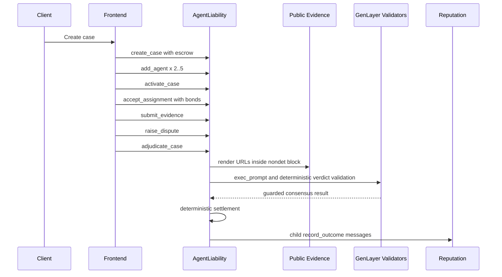

# Architecture

AgentLiability is split into contracts, static frontend, tests, deployment tooling, and documentation.

## Contracts

`contracts/agent_liability.py` is the binding adjudication contract. It stores cases and agent assignment data in parallel `TreeMap` fields and uses `DynArray[u256]` for case IDs. It receives GEN escrow and agent bonds, records evidence URLs, triggers GenLayer web and LLM adjudication, and deterministically settles money after consensus.

`contracts/agent_reputation.py` is deterministic. The owner configures the authorized main contract once. The main contract emits child messages to record each settled agent outcome. Duplicate `(case_id, agent)` updates are rejected.

`contracts/storage_test.py` is a Testnet Bradbury sanity contract with one scalar, one `TreeMap`, one write method, and one read method.

## Frontend

The frontend is a static React/Vite app. It uses `genlayer-js`, imports `Testnet Bradbury`, reads contract state, writes through a browser wallet provider, and tracks transaction acceptance, finalization, execution success, execution failure, debug traces, and child transaction IDs when supported.

## Deployment

Scripts in `scripts/` are guarded to Testnet Bradbury only:

- `deploy.ts`
- `verify-deployment.ts`
- `smoke-test.ts`

They refuse non-Testnet Bradbury RPC or chain settings.

## Data Flow

